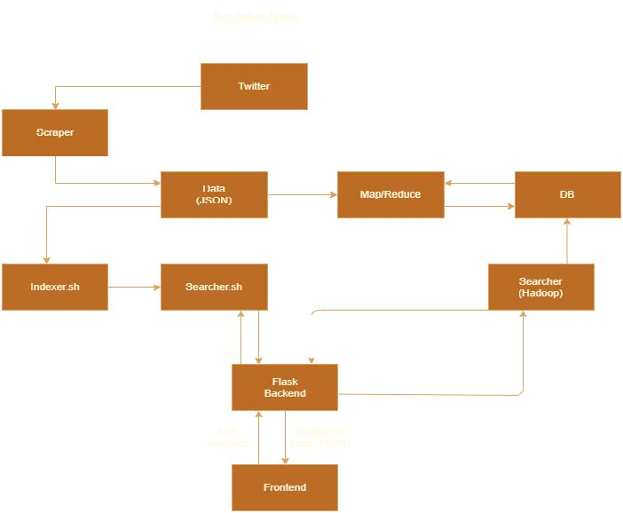
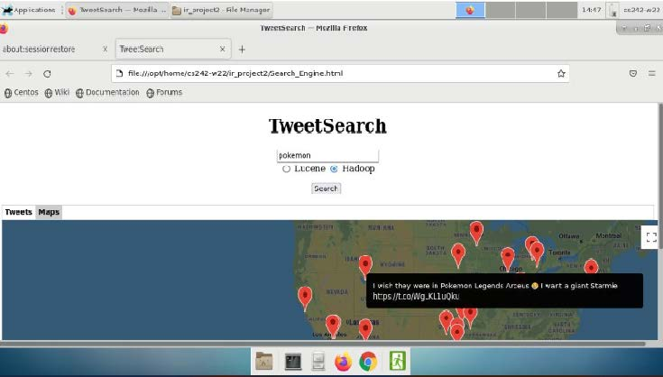

# Twitter map search engine
## About 

Allows users to search tweets and get ranked results and plots them on a world map with the approximate geo tagged location

Build an end-to-end search engine to scrape tweets from twitter and index them using Lucene and map reduce.

Built frontend using javascript and HTML and is  connected to the backend(made with flask) with REST API queries.

Made with a team colaboration for Web Internet retrival graduate course

More info in CS242 IR Project Part B Report.pdf

## Getting Started 
Instructions to Deploy the System

A. Instructions to build Lucene Index

➢ Since simpleJson package is missing in the existing JRE, use the following code

before running the executable files:

export JSON_JAVA=/opt/home/cs242-w22/ #(path to simple json)

export CLASSPATH=$CLASSPATH:$JSON_JAVA/json-simple-1.1.1.jar:.

➢ We have created two separate .sh files:

1. Indexer.sh - Executable file for indexer, takes index directory and data file
as command line arguments.

2. Searcher.sh - Executable file for searcher, takes query term as a command
line argument.

B. Instructions to build Hadoop Index

1) Run MRJob.py on the scraper data to get Indexed File

2) Run Searcher_MR.py with the Indexed file and data File as parameters3) Enter
Search query on command Line

C. Instructions to Run flask server

To run the backend flask server use the following command:
flask run -h localhost -p 5002

To run the frontend run the html file ‘Search_Engine.html’ in any browser.

## Output 

